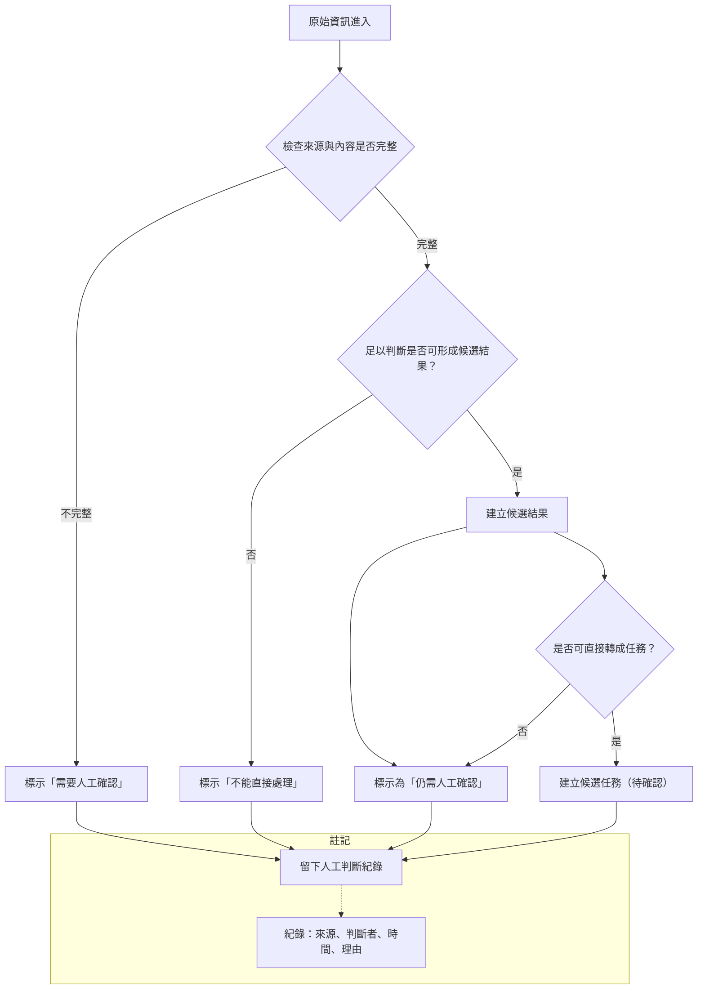

# 資訊流程設計

> 這份文件可以由 Codex 先產生草稿，但你必須用 VS Code 預覽 Mermaid，並由人檢查流程是否合理。

## 我的 v1 目標

請用 2–3 句寫下你現在的 v1 方向。

- 我優先服務的使用者：
- 這個使用者最想完成的事：
- 我最想避免的錯誤：

## 自然語言流程描述

請先用自然語言寫流程，不要一開始就寫 Mermaid。

範例語氣：

```text
原始資訊進來後，資訊整理者先查看來源與原文。
如果資訊不足，標示為需要人工確認。
如果資訊可能誤導行動者，先不要變成候選結果。
如果資訊足夠形成候選結果，建立候選結果，但仍標示為需要人工確認。
每次人工判斷都要留下紀錄。
```

請在下面寫你的流程：

```text

```

## Mermaid 流程圖

請讓 Codex 根據上面的自然語言描述產生 Mermaid。

請用 VS Code 預覽，確認流程圖能正常顯示。



## 人工確認點

請列出流程中哪些地方必須由人判斷。

- 原始資訊被標示為「需要人工確認」時
- 建立候選結果但仍標示為「仍需人工確認」時
- 在將候選結果轉成候選任務前

## 不能自動處理的分支

請列出流程中哪些地方不能讓 AI 自動決定。

-
-

## 操作或判斷紀錄

請說明哪些動作需要留下紀錄。

-
-

## 我檢查後修正了什麼

請寫下你用 `docs/design-checklist.md` 檢查後，至少修正的一件事。

- 原本：
- 修正後：
- 為什麼：

## 我仍不確定的流程點

請列出目前還需要後續驗證或訪談的地方。

-
-
